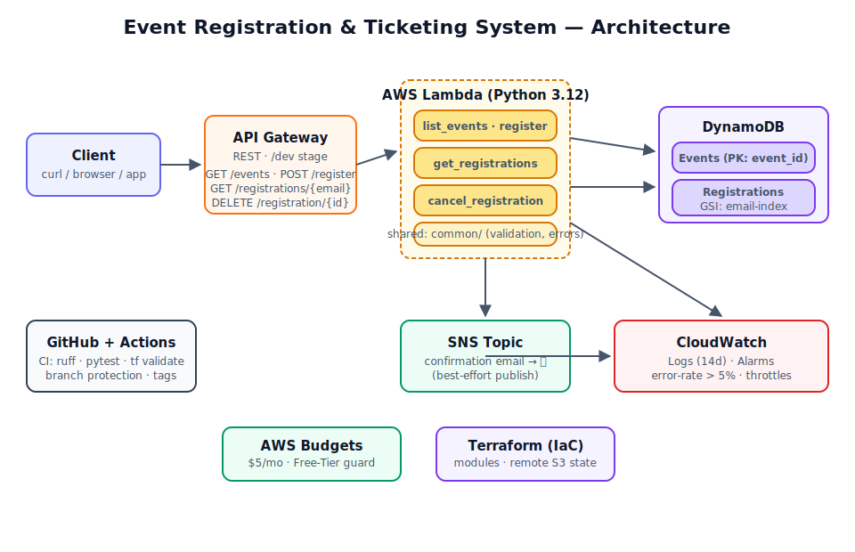

# 🎟️ Event Registration &amp; Ticketing System

> A **serverless** event registration &amp; ticketing platform on AWS — replacing Microsoft Forms + Excel with a scalable, monitored, cost-guarded REST API.


---

## 📖 Overview

This is my cloud-computing capstone: a production-shaped, serverless REST API that lets people register for events, browse events, look up their registrations, and cancel — with **confirmation emails**, **CloudWatch monitoring**, **CI/CD**, and **Free-Tier cost controls**. The entire infrastructure is defined as code (Terraform) and deployed reproducibly from an empty account.

**Why?** The status quo — Microsoft Forms feeding a spreadsheet — doesn't scale, can't validate input, sends no confirmations, and offers no monitoring. This project solves all of that with a proper API.

## 🏗️ Architecture



**Request flow:** Client → **API Gateway** (REST) → **Lambda** (Python) → **DynamoDB**. On registration, Lambda also publishes to **SNS** → confirmation email. **CloudWatch** monitors errors/throttles; **AWS Budgets** guards cost; **GitHub Actions** gates every merge.

## ✨ Features

- **4 REST endpoints** (full CRUD for registrations + events listing)
- **Input validation &amp; sanitization** — every field checked before it touches the DB
- **Duplicate-prevention** — can't register twice for the same event (idempotent)
- **Confirmation emails** via SNS on every registration
- **CloudWatch alarms** — error-rate &gt; 5% &amp; throttles, with email alerts
- **CI/CD** — ruff + 35 unit tests + Terraform validate on every PR; branch protection
- **Cost-guarded** — on-demand billing, log retention, $5/mo budget alerts → ~$0 idle
- **100% Infrastructure-as-Code** — modular Terraform, remote S3 state

## 🔌 API Reference

Base URL: `https://&lt;id&gt;.execute-api.us-east-1.amazonaws.com/dev`

| Method | Path | Purpose | Success |
|--------|------|---------|---------|
| `GET` | `/events` | List all events | `200` |
| `POST` | `/register` | Register for an event | `201` |
| `GET` | `/registrations/{email}` | View a person's registrations | `200` |
| `DELETE` | `/registration/{id}` | Cancel a registration | `200` |

### Examples
```bash
# List events
curl -s "$API/events" | jq

# Register (triggers a confirmation email 📧)
curl -s -X POST "$API/register" -H "Content-Type: application/json" \
  -d '{"event_id":"aws-bootcamp","email":"you@example.com","name":"You"}'

# View your registrations
curl -s "$API/registrations/you@example.com" | jq
```

Errors return proper HTTP codes: `400` (bad input), `404` (event not found), `409` (already registered), `500` (internal).

## 🛠️ Tech Stack

| Layer | Technology |
|-------|-----------|
| Language | Python 3.12 |
| Infra-as-Code | Terraform (modular, remote S3 state) |
| Compute | AWS Lambda |
| API | API Gateway (REST, Lambda Proxy) |
| Database | DynamoDB (on-demand, GSI on email) |
| Notifications | SNS (confirmation emails) |
| Monitoring | CloudWatch Logs + Alarms |
| Cost control | AWS Budgets |
| CI/CD | GitHub Actions (ruff, pytest, terraform validate) |
| Testing | pytest + moto (AWS mocking) |
| Versioning | Git Flow–lite (feature → develop → main, stage tags) |

## 📂 Project Structure
```
event-ticketing-system/
├── .github/workflows/ci.yml      # CI pipeline (lint + tests + tf validate)
├── docs/
│   ├── architecture.svg          # Architecture diagram
│   ├── DEPLOYMENT.md             # Full deploy runbook
│   └── DEVELOPMENT.md            # Git workflow
├── lambda/                       # Lambda handlers (Python)
│   ├── common/                   # Shared lib: responses, validation, errors
│   ├── list_events/  register/  get_registrations/  cancel_registration/
├── terraform/
│   ├── modules/                  # Reusable: dynamodb, iam, lambda_function,
│   │                             #   api_gateway, sns, cloudwatch_alarms, budgets
│   └── environments/dev/         # Composition layer (where you `terraform apply`)
├── scripts/seed_events.py        # Seed sample data
├── tests/unit/                   # 35 unit tests (pytest + moto)
├── requirements-dev.txt
└── README.md
```

## 🚀 Getting Started

Full instructions: [`docs/DEPLOYMENT.md`](docs/DEPLOYMENT.md). Quick version:

```bash
git clone https://github.com/OsikanyiTheDev/event-ticketing-system.git
cd event-ticketing-system
python3 -m venv .venv && source .venv/bin/activate
pip install -r requirements-dev.txt
pytest -v                              # 35 tests

cd terraform/environments/dev
cp terraform.tfvars.example terraform.tfvars   # set notification_email
terraform init && terraform apply
python ../../../scripts/seed_events.py "$(terraform output -raw events_table_name)"
curl -s "$(terraform output -raw api_url)/events" | jq
```

## 🧪 Testing
35 unit tests covering every handler + the shared library, using **moto** to mock AWS (no account/network/cost needed — runs in ~2s):
```bash
pytest -v
ruff check . && ruff format --check .
```

## 📈 Monitoring &amp; Cost
- **Alarms:** per-function Lambda error-rate &gt; 5% (metric math) + throttles → email
- **Logs:** 14-day retention (no infinite growth)
- **Budget:** $5/month, alerts at 50% actual + 100% forecasted
- **Idle cost ≈ $0** — all serverless, on-demand billing

## 🗺️ Versioning
Each stage is a git tag tracing the build from scaffold to release:
`v0.1.0` → `v0.2.0` → … → `v1.0.0`. See [`PROJECT_PLAN.md`](PROJECT_PLAN.md).

## 📜 License
MIT — see [LICENSE](LICENSE).