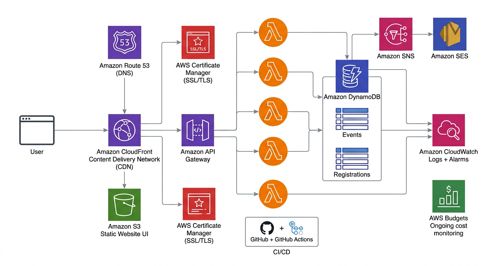

# 🎟️ Event Registration &amp; Ticketing System

> A **serverless** event registration &amp; ticketing platform on AWS — replacing Microsoft Forms + Excel with a scalable, monitored, cost-guarded REST API, served on a custom HTTPS domain.


---

## 📖 Overview

My cloud-computing capstone: a production-shaped, serverless REST API that lets people register for events, browse events, look up registrations, and cancel — with **confirmation emails**, **CloudWatch monitoring**, **CI/CD**, **Free-Tier cost controls**, and a **custom HTTPS domain**. The entire infrastructure is defined as code (Terraform) and deploys reproducibly.

**Why?** The status quo — Microsoft Forms feeding a spreadsheet — doesn't scale, can't validate input, sends no confirmations, and offers no monitoring. This project solves all of that with a proper API.

## 🏗️ Architecture



**Request flow:** Browser → **CloudFront** (HTTPS, custom domain) → **S3** (static UI). The UI calls **API Gateway** (REST) → **Lambda** (Python) → **DynamoDB**. On registration, Lambda emails the registrant via **SES** and notifies the admin via **SNS**. **Route 53** + **ACM** power the custom domain; **CloudWatch** monitors errors/throttles; **AWS Budgets** guards cost; **GitHub Actions** gates every merge. Everything is **Terraform** across two layers (a persistent domain layer + the app).

🌐 **Live:** `https://ticketservice.osikanyi.online` (custom domain over HTTPS via CloudFront + ACM)

## ✨ Features

- **4 REST endpoints** (full CRUD for registrations + events listing)
- **Input validation &amp; sanitization** — every field checked before it touches the DB
- **Duplicate-prevention** — can't register twice for the same event (idempotent)
- **Confirmation emails** — SNS notifies the admin, SES emails the registrant from `hello@osikanyi.online`
- **Custom HTTPS domain** — `https://ticketservice.osikanyi.online` via CloudFront + Route 53 + ACM
- **CloudWatch alarms** — error-rate &gt; 5% &amp; throttles, with email alerts
- **CI/CD** — ruff + unit tests + Terraform validate on every PR; branch protection
- **Cost-guarded** — on-demand billing, log retention, $5/mo budget alerts → ~$0 idle
- **100% Infrastructure-as-Code** — modular Terraform (domain + app layers), remote S3 state

&gt; **Email note:** SES runs in **sandbox** by default (AWS anti-spam) — emails deliver to **verified** recipients. The sending domain `osikanyi.online` is verified with **DKIM + SPF + DMARC**, and production access has been requested. The same code emails any address once approved.

## 🔌 API Reference

| Method   | Path                     | Purpose                       | Success |
| -------- | ------------------------ | ----------------------------- | ------- |
| `GET`    | `/events`                | List all events               | `200`   |
| `POST`   | `/register`              | Register for an event         | `201`   |
| `GET`    | `/registrations/{email}` | View a person's registrations | `200`   |
| `DELETE` | `/registration/{id}`     | Cancel a registration         | `200`   |

Base URL: `https://&lt;id&gt;.execute-api.us-east-1.amazonaws.com/dev` (the UI is wired to it automatically).

```bash
API=$(terraform -chdir=terraform/environments/dev output -raw api_url)
curl -s "$API/events" | jq
curl -s -X POST "$API/register" -H "Content-Type: application/json" \
  -d '{"event_id":"aws-bootcamp","email":"you@example.com","name":"You"}'
curl -s "$API/registrations/you@example.com" | jq
```
Errors map to real codes: `400` bad input · `404` not found · `409` already registered · `500` internal.

## 🛠️ Tech Stack

| Layer         | Technology                                                         |
| ------------- | ------------------------------------------------------------------ |
| Language      | Python 3.12                                                        |
| Infra-as-Code | Terraform (modular, **two layers**: domain + app, remote S3 state) |
| Compute       | AWS Lambda                                                         |
| API           | API Gateway (REST, Lambda Proxy)                                   |
| Database      | DynamoDB (on-demand, GSI on email)                                 |
| Notifications | SNS (admin) + SES (registrant, from the verified domain)           |
| Edge / Domain | CloudFront + Route 53 + ACM (custom HTTPS)                         |
| Monitoring    | CloudWatch Logs + Alarms                                           |
| Cost control  | AWS Budgets                                                        |
| CI/CD         | GitHub Actions (ruff, pytest, terraform validate)                  |
| Testing       | pytest + moto (AWS mocking)                                        |
| Versioning    | Git Flow–lite (feature → develop → main, stage tags)               |

## 📂 Project Structure
```
event-ticketing-system/
├── .github/workflows/ci.yml      # CI: lint + tests + tf validate
├── docs/                         # architecture.png, DEPLOYMENT.md, DEVELOPMENT.md
├── frontend/                     # Static UI (HTML/CSS/JS) → S3 + CloudFront
├── lambda/                       # Handlers + shared common/ library
├── terraform/
│   ├── domain/                   # PERSISTENT layer: Route 53, ACM, SES (+SPF/DMARC)
│   ├── environments/dev/         # App layer: where you `terraform apply`
│   └── modules/                  # dynamodb, iam, lambda_function, api_gateway,
│                                 #   sns, ses, cloudwatch_alarms, budgets,
│                                 #   s3_website, cloudfront
├── scripts/                      # restore.sh, deploy_ui.sh, seed_events.py
├── tests/unit/                   # Unit tests (pytest + moto)
└── requirements-dev.txt
```

## 🚀 Getting Started

Full runbook: [`docs/DEPLOYMENT.md`](docs/DEPLOYMENT.md). One-command restore (rebuilds domain + app + UI):
```bash
git clone https://github.com/OsikanyiTheDev/event-ticketing-system.git
cd event-ticketing-system
python3 -m venv .venv && source .venv/bin/activate
pip install -r requirements-dev.txt
bash scripts/restore.sh          # applies both layers, seeds, deploys UI
```
Then open `https://ticketservice.osikanyi.online`.

## 🧪 Testing
```bash
pytest -v
ruff check . && ruff format --check .
```
Unit tests cover every handler + the shared library, mocking AWS with **moto** (no account/network/cost — ~2s).

## 📈 Monitoring &amp; Cost
- **Alarms:** per-function Lambda error-rate &gt; 5% (metric math) + throttles → email
- **Logs:** 14-day retention (no infinite growth)
- **Budget:** $5/month, alerts at 50% actual + 100% forecasted
- **Idle cost ≈ $0** — all serverless, on-demand billing

## 🗺️ Versioning
Each stage is a git tag tracing the build from scaffold to release:
`v0.1.0` → `v0.2.0` → … → `v1.0.0`. See [`PROJECT_PLAN.md`](PROJECT_PLAN.md).

## 📜 License
MIT — see [LICENSE](LICENSE).
